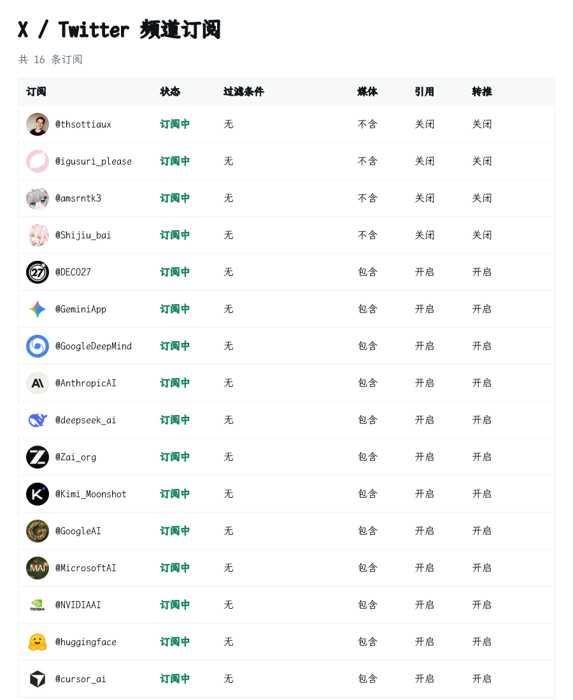
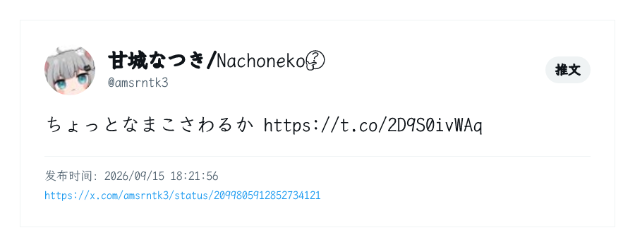
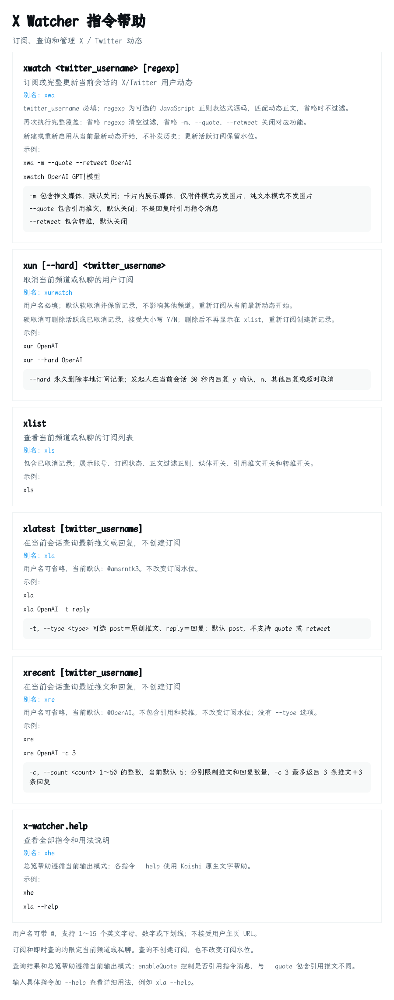

# 🐦 koishi-plugin-x-watcher

在频道或私聊中订阅指定 X/Twitter 用户的原创、回复、引用和转推。插件支持 Rettiwt 轮询、TwitterAPI.io REST 轮询和 TwitterAPI.io Account Stream WebSocket；每个插件实例只运行一种数据源和模式，不会并行抓取或自动降级。

运行环境要求 Node.js 22.17 或更高版本。Node.js 22 和 24 已通过自动化测试；Node.js 26 由兼容性测试矩阵持续验证。固定依赖 `rettiwt-api@7.1.2` 仍将运行时声明限制在 22.x，因此在 Node.js 24 或 26 安装时可能出现 `EBADENGINE` 警告，但不会在未启用 `engine-strict` 时阻止安装。

## 🖥️ X 订阅管理页面

启用必需服务 `console`（`@koishijs/plugin-console`）后，Koishi 控制台左侧会出现 **X 订阅管理**，地址为 `/x-watcher`。缺少 console 时插件等待服务就绪。

> ⚠️ **仅支持单实例运行**：本插件仅针对单实例场景设计和测试。多个实例同时运行，尤其是共用数据库时，可能出现重复推送、订阅状态相互影响等非预期行为，请仅启用一个实例。`reusable = false` 约束同一 Koishi 应用内的插件重复加载，不阻止不同进程、不同部署或不同源码副本同时运行。

- 页面采用 X 网页风格：账号列表、状态标签和右侧详情；适配 Koishi 明暗主题，窄屏通过抽屉编辑。
- 默认显示全部订阅（包括已取消记录），可按账号、平台、机器人、频道和状态筛选；每页 20 条，可切换 50 / 100 条。
- 支持新增、修改推送规则、取消、恢复和永久删除；删除需要弹窗二次确认。网页不发送群消息，也不执行指令的 `session.prompt`。
- 新建时选择已加载机器人，再选择已有频道 ID 或输入适配器实际 `channelId`；私聊同样要求真实频道标识，不把数字自动当作群号或用户号。媒体、引用、转推默认关闭。
- 同一平台、频道、稳定 X 用户 ID 只维护一条订阅；重复添加提示编辑或恢复现有记录。账号和频道不可直接改写；同平台发送机器人可调整。
- 新增和恢复从最新水位开始，不补发历史；编辑已取消记录不会自动恢复。规则编辑、取消和删除不依赖 X API 可用。离线或未加载机器人会明确标注。
- 网页和指令共用订阅表及管理写入队列。旧页面不能覆盖已变更的管理设置，正常 worker 水位更新不令编辑失效。Stream 同步失败时保留本地结果并提示待重试。
- 页面及全部接口要求权限等级 **3**；启用 Koishi auth 时未登录、登录过期或低权限用户不能访问。未启用 auth 时沿用 Koishi 的可信控制台行为，控制台访问者可以管理订阅。
- 页面首次打开、操作后刷新，可见时每 15 秒自动刷新。数据库迁移未完成、初始化失败或插件卸载后禁止管理写入。
- API 密钥、代理和渲染等全局设置仍在插件配置页修改；管理页面不返回密钥或完整配置。网页新增记录的操作来源记为 `console:x-watcher`。

## ⚙️ 配置

### 🔄 Rettiwt 轮询

| 配置项 | 类型 | 默认值 | 说明 |
| --- | --- | --- | --- |
| `apiKeys` | `string[]` | 无，必填 | Rettiwt Cookie API Key 池；按配置顺序故障转移 |
| `interval` | `number` | `5` | 检查间隔，单位为分钟，最小值为 `1` |
| `outputMode` | `string` | `card-text` | 单选：纯文本、文本＋图片附件、Takumi 卡片、卡片＋文本、卡片＋文本＋图片附件，具体取值见下表 |
| `recentDefaultUsername` | `string` | `OpenAI` | `xrecent` 省略用户名时查询的账号，不需要填写 `@`；默认账号：[https://x.com/OpenAI](https://x.com/OpenAI) |
| `recentDefaultCount` | `number` | `5` | `xrecent` 默认每类获取数量；表示推文和回复各取此数量，只接受 `1`～`50` 的整数 |
| `latestDefaultUsername` | `string` | `amsrntk3` | `xlatest` 省略用户名时查询的账号，不需要填写 `@`；默认账号：[https://x.com/amsrntk3](https://x.com/amsrntk3) |
| `activityTypes` | `("post" \| "reply")[]` | `["post", "reply"]` | 自动推送的动态类型；引用和转推仍由 `watch` 命令选项控制 |
| `maxPostCount` | `number` | `5` | 单轮每条订阅最多推送的最新推文数；`0` 或负数表示不限量 |
| `maxReplyCount` | `number` | `5` | 单轮每条订阅最多推送的最新回复数；`0` 或负数表示不限量 |
| `fontAssetPathRelativeToBaseDir` | `string[]` | `["data", "fonts", "LXGWWenKaiMono-Regular.ttf"]` | Takumi 字体路径片段；依次拼接到 Koishi 根目录 `ctx.baseDir`，当前为只读配置且不会自动下载字体 |
| `watcherAvatarRefreshMode` | `"cache" \| "placeholder" \| "always"` | `cache` | `xlist` 图片中头像的更新策略；`cache` 缺失时补查并缓存，`placeholder` 仅使用缓存并显示首字母，`always` 每次列表时刷新 |
| `takumiImageFormat` | `"jpg" \| "png" \| "webp"` | `jpg` | Takumi 图片输出格式；JPG 默认可降低 OneBot 上传体积 |
| `takumiImageQuality` | `number` | `50` | JPG 输出质量，范围 `0`～`100`；PNG 与 WebP 下会被 Takumi WASM 忽略 |
| `takumiImageMaxSizeMiB` | `number` | `5` | 每张渲染图和图片附件的二进制大小上限，最小 0.01 MiB；超限后调用 FFmpeg 转 JPEG 压缩 |
| `takumiMediaMaxWidth` | `number` | `666` | 卡片内每张配图的最大宽度（px，正整数），同时受列宽限制 |
| `takumiMediaMaxHeight` | `number` | `333` | 卡片内每张配图的最大高度（px，正整数） |
| `takumiMediaCrop` | `"none" \| "mild" \| "aggressive"` | `mild` | 单选：完全不裁剪、轻微裁剪（最多损失 15% 面积，默认）、激进裁剪（居中填满）；前两者不放大小图，激进裁剪允许放大 |
| `takumiMediaLayout` | `"grid-2" \| "column" \| "grid-3"` | `grid-2` | 多图排列：两列网格、单列纵排、三列网格 |
| `enableQuote` | `boolean` | `true` | 指令触发的所有回复是否引用触发消息；主动订阅推送不引用 |
| `enableWaitingHint` | `boolean` | `true` | `xlatest` 和 `xrecent` 查询及渲染期间是否显示临时等待提示；最终回复后自动撤回 |
| `enableProxy` | `boolean` | `false` | 是否启用插件代理 |
| `proxyUrl` | `string` | `http://127.0.0.1:7890` | 代理服务器地址，用于 Rettiwt 请求及插件附件下载 |

代理会同时传给 Rettiwt 的 Axios 请求，并接管其 `x-client-transaction-id`
依赖使用的 Node 原生 `fetch`。由于 Node 的 dispatcher 是进程级资源，启用期间其他
使用全局 `fetch` 的插件也会使用该代理；插件卸载时会在 dispatcher 未被其他组件替换的
前提下恢复原值。支持 HTTP(S) 与 SOCKS5（`socks://` 或 `socks5://`）代理。

API Key 池始终按配置顺序故障转移，不做负载均衡；认证失败的 Key 会在当前进程隔离，触发 429 的 Key 冷却 60 秒。

Rettiwt Cookie API Key 获取方法：

1. 打开你的浏览器（Chrome/Chromium 内核/Firefox/Firefox 内核），访问 Twitter/X。
2. 按下键盘上的 F12 键，打开浏览器开发者工具。
3. 导航至 应用程序 -> Cookie（Chrome/Chromium 内核）或 存储 -> Cookie（Firefox/Firefox 内核）。
4. 复制以下 3 个字段的值：auth_token、ct0、twid。这些将作为你的身份验证凭据。
5. 进入浏览器开发者工具的控制台 ，执行命令：btoa("auth_token=<auth_token_value>;ct0=<ct0_value>;twid=<twid_value>;")。将token值替换为你复制的对应内容。
6. 输出的字符串即为你的 API_KEY。

## 🔁 从 0.1.x 迁移

旧 `auth_key` 配置不再兼容。：

插件在 `ready` 生命周期幂等迁移原有 `x_watcher` 表：

- 新增 `include_quote`、`include_retweet`，旧订阅都回填为 `false`。
- 新增 `enabled_at`，依次使用旧 `update_at`、`create_at` 或迁移时间。
- 原有频道、订阅状态、正则、媒体开关和 Snowflake 处理进度保持不变。

迁移失败时不会注册命令，也不会启动轮询。

## 🧰 命令

| 指令 | 别名 | 功能 | 选项与默认值 | 示例 |
| --- | --- | --- | --- | --- |
| 📡 `x-watcher.watch <username> [regexp]` | `xwatch`、`xwa` | 订阅或完整更新当前会话的用户动态；可用正则过滤正文 | `-m` 包含媒体；`--quote` 包含引用推文；`--retweet` 包含转推，三项默认均关闭 | `xwa -m --quote --retweet OpenAI`；`xwatch OpenAI GPT\|model` |
| 🔕 `x-watcher.unwatch <username>` | `xun`、`xunwatch` | 取消当前会话的用户订阅 | 默认软取消、保留记录；`--hard` 永久删除，需回复 `y` 确认 | `xun OpenAI`；`xun --hard OpenAI` |
| 📋 `x-watcher.list` | `xlist`、`xls` | 查看当前会话订阅及规则，包含已取消记录 | 无专用选项 | `xls` |
| 🆕 `x-watcher.latest [username]` | `xlatest`、`xla` | 即时查询最新一条原创推文或回复 | `-t, --type <type>`：`post`＝原创推文（默认）、`reply`＝回复；省略账号使用 `latestDefaultUsername`，初始值 `amsrntk3` | `xla`；`xla OpenAI -t reply` |
| 🕒 `x-watcher.recent [username]` | `xrecent`、`xre` | 合并查询最近原创推文和回复，不含引用或转推 | `-c, --count <count>`：每类 `1`～`50` 条，默认取 `recentDefaultCount`（初始值 `5`）；省略账号使用 `recentDefaultUsername`（初始值 `OpenAI`）；没有 `--type` 选项 | `xre`；`xre OpenAI -c 20` |
| ❓ `x-watcher.help` | `xhe`、`xhelp` | 查看全部指令、别名、选项、当前默认值及示例 | 各指令也可加 `--help` 查看原生文字帮助 | `xhe`；`xla --help` |

> **参数格式**：`<参数>` 必填，`[参数]` 可选。用户名可带 `@`，支持 1～15 个英文字母、数字或下划线，不接受主页 URL。`regexp` 为 JavaScript 正则表达式源码，仅匹配当前动态正文；省略时不过滤。

### 📡 订阅与取消

> **会话范围**：订阅按频道或私聊隔离，频道中的任何成员都可以管理当前频道订阅。默认订阅原创和回复；自动推送的这两类动态可通过 `activityTypes` 配置调整，引用和转推由订阅选项控制。

> **媒体开关**：`-m` 允许卡片展示媒体，并在附件模式下另发图片；纯文本模式不发图片。GIF 独立附件使用首帧，视频通过原文链接查看。`--quote` 表示包含引用推文，与 `enableQuote` 引用指令消息不同。

> **完整覆盖**：再次执行 `xwatch` 会替换整条规则：省略正则清空过滤，省略 `-m`、`--quote`、`--retweet` 关闭对应功能。非法正则在命令阶段拒绝；数据库中意外存在的非法规则按 fail-closed 处理，不投递匹配结果。

> **起始进度**：新订阅和重新启用均从当前最新动态开始，不补发历史；更新活跃订阅保留水位。默认软取消保留记录，`xlist` 仍会显示；恢复订阅时重新设置起始位置。

> **永久删除**：`xun --hard <username>` 可删除当前频道或私聊中活跃、已取消的订阅。发起人须在同一会话 30 秒内回复 `y` 确认、`n` 取消，不区分大小写并忽略首尾空白；其他回复或超时也取消。下一条回复由确认流程接收，不作为其他命令执行。

> **删除结果**：硬取消后记录不再出现在 `xlist`，重新订阅会创建新记录。等待确认期间记录已变化则需重新操作；远端 Stream 同步失败不撤销本地删除，会提示等待重试。其他频道的订阅不受影响。

### 🔎 即时查询与帮助

> **仅当前会话**：`xla`、`xre` 只回复触发指令的当前频道或私聊，遵守 `enableQuote`，不向所有订阅频道广播，不创建订阅或改变水位。后台订阅推送独立运行。

> **查询数量**：`xrecent -c 10` 表示最多获取 10 条推文和 10 条回复，而非总共 10 条；参数和配置均限制为 `1`～`50` 的整数。`xlatest --type` 只接受 `post`、`reply`，不支持引用或转推。

> **帮助形式**：`xhe` 与各指令 `--help` 共用用法说明。`xhe` 和 `xlist` 使用所选输出模式的卡片、文字部分，不附加推文媒体；`--help` 始终保留 Koishi 原生文字帮助。

> **文字标识**：文字帮助、查询结果和操作反馈带 Emoji；`xrecent` 每条序号前以 📝 区分推文、💬 区分回复。Takumi 卡片不添加这些装饰，原始正文不变。

### 🖼️ 消息模式与媒体

> **模式选择**：`outputMode` 为单选配置，旧 `outputFormats` 不再读取；升级后请重新选择偏好，未配置时默认 `card-text`。

| 值 | 模式 |
| --- | --- |
| `text` | 纯文本和原文链接，不含图片 |
| `text-media` | 文本和独立图片附件 |
| `card` | Takumi 图片卡片 |
| `card-text` | Takumi 图片卡片＋文本（默认） |
| `card-text-media` | Takumi 图片卡片＋文本＋独立图片附件 |

> **输出顺序**：卡片、文字、附件按顺序发送；文字使用普通换行，外部内容转义后发送。`xre` 的附件标注所属动态序号。卡片内媒体与独立附件分别控制，自动推送仍遵守订阅的 `-m` 开关；未启用媒体时，卡片也不包含推文媒体。

> **最近动态分页**：`xrecent` 使用 Takumi WASM，每张卡片最多 10 条动态；引用、分页卡片、文字及所选附件放在同一条消息中。卡片内图片直接展示，GIF 和视频展示封面，媒体不可用时显示原因占位。

> **配图布局**：默认在 666×333 px 上限内轻微居中裁剪，最多损失 15% 面积，等比缩小、不放大小图。单张居中；多图按所选列数从左到右、从上到下排列，间距 14 px，末行不足时靠左、保持原列宽。图片在各自列内水平居中、顶部对齐，每行高度随内容收缩。

> **裁剪模式**：`takumiMediaCrop` 为 `none`（完全不裁剪）、`mild`（轻微裁剪，默认）、`aggressive`（激进裁剪）三档单选，不兼容旧 `true` / `false`；旧配置需重新选择或删除该字段。`mild` 向有效列宽和最大高度形成的图片框比例靠拢，至少保留原图面积的 85%，必要时不铺满；`aggressive` 居中填满、不限制裁剪量并允许放大。裁剪不拉伸图片。

> **布局范围**：配图尺寸、布局与裁剪适用于 `xla`、`xre`、自动推送卡片内的图片及 GIF/视频封面，不改变文字、头像、整张卡片宽度或独立附件尺寸。加载或尺寸读取失败时显示最多 96 px 高的占位。

> **FFmpeg 服务**：必须启用 `koishi-plugin-ffmpeg` 或 `koishi-plugin-ffmpeg-path`，后者支持配置本地路径或自动下载；缺少服务时插件等待就绪。GIF 和视频缺少供应商封面时，通过 FFmpeg 提取首帧，失败则显示原因占位。

> **图片体积**：每张 Takumi 图片和独立图片附件默认最多 5 MiB（5 × 1024 × 1024 字节），由 `takumiImageMaxSizeMiB` 控制。未超限保留原格式；超限使用 FFmpeg 转 JPEG，先降质量再缩尺寸，最多尝试 8 次。卡片失败回退文字，附件失败跳过并提示，不发送超限图片；上限按单张计算，不是整条消息的总大小。

> **附件下载**：所有数据源的独立附件均由插件按代理配置下载，再以 Base64 图片发送，不把原图 URL 交给 NapCat；关闭代理时直连。每次输出最多并发 3 个附件任务，下载超时 15 秒，最多跟随 3 次重定向，同次下载按 URL 复用。

> **附件类型**：GIF 转首帧静态图片；视频不作为独立附件发送，请通过原文链接查看。单个附件失败不会阻止其他内容发送。

## 📬 投递与一致性

- 同一个 X 用户即使被多个频道订阅，每轮也只抓取一次，再按各频道的处理进度、类型开关和正则独立路由。
- 过滤不匹配或类型关闭的动态属于已消费，会推进该订阅的处理进度。
- 消息从旧到新发送；发送失败会停止该订阅本轮处理，不越过失败项。
- 发送成功但处理进度写入失败时，后续恢复可能产生至少一次重复投递；插件不使用持久化 outbox。
- WebSocket 投递失败会主动断线，至少等待 90 秒后重连并通过 REST 补漏。
- 时间固定显示为上海时区，消息包含分类标题、正文和原文链接。

## 🖼️ 指令效果预览

> 以下为各指令的图片示例；实际输出随配置、动态内容和插件版本变化。

### 📋 xlist / xls：订阅列表

### 🆕 xlatest / xla：最新动态

### 🕒 xrecent / xre：最近动态

### ❓ xhelp / xhe：指令帮助

